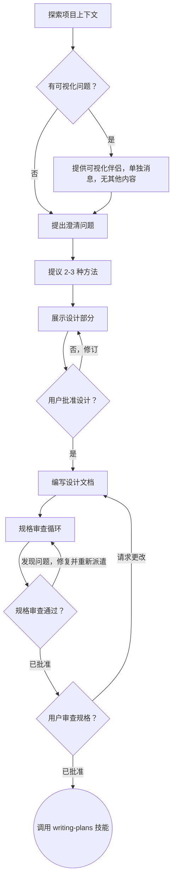

# 头脑风暴：从想法到设计

通过自然的协作对话，帮助将想法转化为完整的设计和规格。

首先了解当前项目上下文，然后逐一提问来提炼想法。一旦理解了要构建的内容，展示设计并获得用户批准。

<HARD-GATE>
在展示设计并获得用户批准之前，不要调用任何实现技能、编写任何代码、搭建任何项目或采取任何实现行动。这适用于每个项目，无论看起来多么简单。
</HARD-GATE>

## 反模式："这太简单了不需要设计"

每个项目都要经历这个过程。待办事项列表、单一功能工具、配置更改——所有这些。"简单"项目往往是未经审查的假设导致最多浪费工作的地方。设计可以简短（对于真正简单的项目只需几句话），但必须展示并获得批准。

## 检查清单

你必须为以下每个项目创建任务并按顺序完成：

1. **探索项目上下文** — 检查文件、文档、最近提交
2. **提供可视化伴侣**（如果主题将涉及可视化问题）— 这是单独的消息，不与澄清问题组合。参见下面的可视化伴侣部分。
3. **提出澄清问题** — 一次一个，了解目的/约束/成功标准
4. **提议 2-3 种方法** — 包括权衡和你的建议
5. **展示设计** — 按其复杂度缩放的部分，在每个部分后获得用户批准
6. **编写设计文档** — 保存到 `docs/superpowers/specs/YYYY-MM-DD-<topic>-design.md` 并提交
7. **规格审查循环** — 派遣具有精确编写的审查上下文的 spec-document-reviewer 子代理（绝不是你的会话历史）；修复问题并重新派遣直到批准（最多 5 次迭代，然后升级给人工）
8. **用户审查书面规格** — 在继续之前请求用户审查规格文件
9. **过渡到实现** — 调用 writing-plans 技能创建实现计划

## 流程图

**终点状态是调用 writing-plans。** 不要调用 frontend-design、mcp-builder 或任何其他实现技能。头脑风暴后唯一可调用的技能是 writing-plans。

## 流程

**理解想法：**

- 首先检查当前项目状态（文件、文档、最近提交）
- 在询问详细问题之前，评估范围：如果请求描述了多个独立的子系统（例如"构建一个具有聊天、文件存储、计费和分析的平台"），立即标记。不要花时间提炼需要先分解的项目细节。
- 如果项目对单个规格来说太大，帮助用户分解为子项目：独立的部分是什么？它们如何关联？应按什么顺序构建？然后通过正常的设计流程对第一个子项目进行头脑风暴。每个子项目都有自己独立的规格 → 计划 → 实现循环。
- 对于范围适当的项目，逐一提问来提炼想法
- 尽可能使用选择题，但开放式问题也可以
- 每条消息只问一个问题——如果主题需要更多探索，将其分解为多个问题
- 专注于理解：目的、约束、成功标准

**探索方法：**

- 提议 2-3 种不同的方法及其权衡
- 以对话方式展示选项，包括你的建议和理由
- 以你推荐的选项开头并解释原因

**展示设计：**

- 一旦确信理解了要构建的内容，展示设计
- 根据复杂度调整每个部分的详略：如果直观，只需几句话；如果复杂，最多 200-300 字
- 在每个部分后询问目前是否正确
- 覆盖：架构、组件、数据流、错误处理、测试
- 如果某些内容不合理，随时准备回去澄清

**为隔离和清晰而设计：**

- 将系统分解为更小的单元，每个单元都有明确的目的，通过定义良好的接口通信，并且可以独立理解和测试
- 对于每个单元，应能回答：它做什么？如何使用它？它依赖什么？
- 其他人能否在不阅读内部实现的情况下理解单元的功能？能否在不破坏调用方的情况下更改内部实现？如果不能，边界需要改进。
- 更小的、边界良好的单元也更容易处理——你更擅长推理可以一次性保持在上下文中的代码，且文件专注时编辑更可靠。当文件变大时，这通常是它承担了过多职责的信号。

**在现有代码库中工作：**

- 在提议更改之前探索当前结构。遵循现有模式。
- 当现有代码存在影响工作的问题时（例如文件变得太大、边界不清晰、职责纠缠），将针对性改进作为设计的一部分——就像优秀的开发者在工作中改进代码一样。
- 不要提议无关的重构。专注于服务于当前目标的内容。

## 设计之后

**文档：**

- 将验证的设计（规格）写入 `docs/superpowers/specs/YYYY-MM-DD-<topic>-design.md`
  - （用户对规格位置的偏好覆盖此默认值）
- 如果可用，使用 elements-of-style:writing-clearly-and-concisely 技能
- 将设计文档提交到 git

**规格审查循环：**
编写规格文档后：

1. 派遣 spec-document-reviewer 子代理（参见 spec-document-reviewer-prompt.md）
2. 如果发现问题：修复、重新派遣、重复直到批准
3. 如果循环超过 5 次迭代，升级给人工寻求指导

**用户审查关口：**
规格审查循环通过后，请求用户在继续之前审查书面规格：

> "规格已编写并提交到 `<path>`。请审查它，在开始编写实现计划之前，让我知道你是否想进行任何更改。"

等待用户的响应。如果他们请求更改，进行更改并重新运行规格审查循环。只有在用户批准后才继续。

**实现：**

- 调用 writing-plans 技能创建详细的实现计划
- 不要调用任何其他技能。writing-plans 是下一步。

## 关键原则

- **一次一个问题** — 不要用多个问题压倒用户
- **优先使用选择题** — 比开放式更容易回答（在可能时）
- **严格 YAGNI** — 从所有设计中移除不必要的功能
- **探索替代方案** — 在确定前总是提议 2-3 种方法
- **增量验证** — 展示设计，在继续前获得批准
- **保持灵活** — 当某些内容不合理时回去澄清

## 可视化伴侣

用于在头脑风暴期间展示模型、图表和可视化选项的浏览器辅助工具。作为工具可用——不是模式。接受伴侣意味着它可用于受益于可视化处理的问题；但这不代表每个问题都通过浏览器进行。

**提供伴侣：** 当预期即将讨论的问题涉及可视化内容（模型、布局、图表）时，一次性提出以获得同意：
> "我们即将讨论的一些内容如果能在 Web 浏览器中展示可能更容易理解。我可以随时整理模型、图表、对比和其他可视化内容。此功能仍较新，可能消耗较多 token。想试试吗？（需要打开本地 URL）"

**此提议必须是单独的消息。** 不要将其与澄清问题、上下文摘要或任何其他内容组合。消息应仅包含上述提议，没有其他内容。在继续前等待用户响应。如果他们拒绝，则继续纯文本头脑风暴。

**每个问题的决策：** 即使在用户接受后，也要为每个问题决定使用浏览器还是终端。判断标准：**用户通过看到它比阅读它更好地理解这个问题吗？**

- **使用浏览器**处理可视化内容——模型、线框图、布局比较、架构图、并排可视化设计
- **使用终端**处理文本内容——需求问题、概念选择、权衡列表、A/B/C/D 文本选项、范围决策

关于 UI 主题的问题不自动是可视化问题。"在这种情况下个性意味着什么？"是概念问题——使用终端。"哪种向导布局更好？"是可视化问题——使用浏览器。

如果他们同意使用伴侣，在继续前阅读详细指南：
`skills/brainstorming/visual-companion.md`
