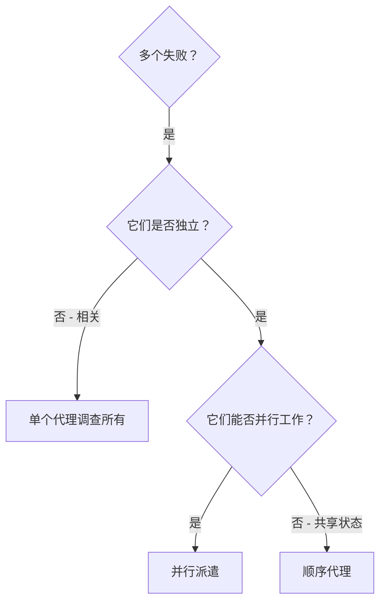

# 派遣并行代理

## 概述

将任务委托给拥有独立上下文的专业代理。通过精心设计指令和上下文，确保代理保持专注并成功完成任务。代理不应继承当前会话的上下文或历史——你需要准确构建他们所需的内容。这也为主会话的协调工作保留了上下文空间。

当存在多个不相关的失败（不同测试文件、不同子系统、不同 bug）时，逐一顺序调查会浪费时间。每个调查都是独立的，可以并行执行。

**核心原则：** 每个独立问题域派遣一个代理。让他们并发工作。

## 何时使用



**使用条件：**
- 3 个以上测试文件因不同原因失败
- 多个子系统独立损坏
- 每个问题可以在没有其他上下文的情况下理解
- 调查之间没有共享状态

**不使用条件：**
- 失败相关（修复一个可能修复其他）
- 需要了解完整系统状态
- 代理会相互干扰

## 模式

### 1. 识别独立域

按损坏内容对失败分组：
- 文件 A 测试：工具审批流程
- 文件 B 测试：批处理完成行为
- 文件 C 测试：中止功能

每个域都是独立的 — 修复工具审批不影响中止测试。

### 2. 创建专注的代理任务

每个代理获得：
- **特定范围：** 一个测试文件或子系统
- **明确目标：** 使这些测试通过
- **约束：** 不要更改其他代码
- **预期输出：** 你发现和修复的内容摘要

### 3. 并行派遣

```typescript
// 在 Claude Code / AI 环境中
Task("修复 agent-tool-abort.test.ts 失败")
Task("修复 batch-completion-behavior.test.ts 失败")
Task("修复 tool-approval-race-conditions.test.ts 失败")
// 三个同时运行
```

### 4. 审查和集成

当代理返回时：
- 阅读每个摘要
- 验证修复不冲突
- 运行完整测试套件
- 集成所有更改

## 代理提示结构

优质的代理提示应具备：
1. **专注** - 针对一个明确的问题域
2. **自包含** - 包含理解问题所需的全部上下文
3. **输出明确** - 清晰说明代理应返回什么

```markdown
修复 src/agents/agent-tool-abort.test.ts 中的 3 个失败测试：

1. "should abort tool with partial output capture" - 期望消息中有 'interrupted at'
2. "should handle mixed completed and aborted tools" - 快速工具中止而不是完成
3. "should properly track pendingToolCount" - 期望 3 个结果但得到 0

这些是时序/竞态条件问题。你的任务：

1. 阅读测试文件并理解每个测试验证什么
2. 识别根本原因 - 时序问题还是实际 bug？
3. 通过以下方式修复：
   - 用基于事件的等待替换任意超时
   - 如果发现，修复中止实现中的 bug
   - 如果测试行为已更改，调整测试期望

不要只是增加超时 - 找到真正的问题。

返回：你发现和你修复的内容摘要。
```

## 常见错误

**❌ 范围太广：** "修复所有测试" - 代理会迷失方向
**✅ 范围具体：** "修复 agent-tool-abort.test.ts" - 专注明确

**❌ 缺少上下文：** "修复竞态条件" - 代理不知道从何入手
**✅ 提供上下文：** 附上错误消息和测试名称

**❌ 没有约束：** 代理可能会重构所有内容
**✅ 设定约束：** "不要更改生产代码" 或 "仅修复测试"

**❌ 输出模糊：** "修复它" - 你不知道改了什么
**✅ 输出明确：** "返回根本原因和修改摘要"

## 何时不使用

**相关失败：** 修复一个可能连带修复其他——应先一起调查
**需要完整上下文：** 理解问题需要看到整个系统全貌
**探索性调试：** 尚不清楚哪里出了问题
**共享状态：** 代理会相互干扰（编辑相同文件，使用相同资源）

## 会话中的真实示例

**场景：** 大重构后 3 个文件中有 6 个测试失败

**失败：**
- agent-tool-abort.test.ts：3 个失败（时序问题）
- batch-completion-behavior.test.ts：2 个失败（工具未执行）
- tool-approval-race-conditions.test.ts：1 个失败（执行计数 = 0）

**决策：** 独立域 — 中止逻辑与批处理完成与竞态条件分离

**派遣：**
```
代理 1 → 修复 agent-tool-abort.test.ts
代理 2 → 修复 batch-completion-behavior.test.ts
代理 3 → 修复 tool-approval-race-conditions.test.ts
```

**结果：**
- 代理 1：用基于事件的等待替换超时
- 代理 2：修复事件结构 bug（threadId 在错误位置）
- 代理 3：添加等待异步工具执行完成

**集成：** 所有修复独立，无冲突，完整套件通过

**节省时间：** 3 个问题并行解决 vs 顺序解决

## 关键好处

1. **并行化** - 多个调查同时进行
2. **专注** - 每个代理范围窄，要跟踪的上下文少
3. **独立性** - 代理不相互干扰
4. **速度** - 在 1 个问题的时间内解决 3 个问题

## 验证

代理返回后：
1. **审查每个摘要** - 了解修改了什么
2. **检查冲突** - 代理是否编辑了相同代码？
3. **运行完整套件** - 验证所有修复能协同工作
4. **抽查** - 代理可能犯系统性错误

## 现实世界影响

来自调试会话 (2025-10-03)：
- 3 个文件中有 6 个失败
- 并行派遣 3 个代理
- 所有调查并发完成
- 所有修复成功集成
- 代理更改之间零冲突
