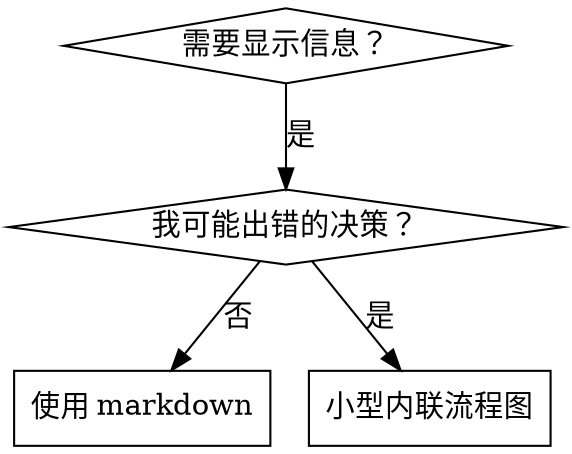

# 编写技能

## 概述

**编写技能就是应用于流程文档的测试驱动开发。**

**个人技能存放在代理特定目录（Claude Code 的 `~/.claude/skills`，Codex 的 `~/.agents/skills/`）**

你编写测试用例（子代理的压力场景），看它们失败（基线行为），编写技能（文档），看测试通过（代理合规），并重构（关闭漏洞）。

**核心原则：** 如果你没有看到代理在没有技能的情况下失败，你不知道技能是否教授了正确的东西。

**必需背景：** 在使用此技能之前，你必须理解 superpowers:test-driven-development。该技能定义了基本的红-绿-重构循环。此技能将 TDD 适应于文档。

**官方指导：** 有关 Anthropic 的官方技能创作最佳实践，请参见 anthropic-best-practices.md。此文档提供了补充此技能中 TDD 专注方法的额外模式和指南。

## 什么是技能？

**技能**是经过验证的技术、模式或工具的参考指南。技能帮助未来的 Claude 实例找到并应用有效的方法。

**技能是：** 可重用的技术、模式、工具、参考指南

**技能不是：** 关于你如何一次解决问题的叙述

## TDD 映射到技能

| TDD 概念 | 技能创建 |
|----------|----------|
| **测试用例** | 子代理的压力场景 |
| **生产代码** | 技能文档（SKILL.md） |
| **测试失败（RED）** | 代理在没有技能的情况下违反规则（基线） |
| **测试通过（GREEN）** | 代理在有技能的情况下合规 |
| **重构** | 在保持合规的同时关闭漏洞 |
| **先写测试** | 在编写技能之前运行基线场景 |
| **看它失败** | 记录代理使用的确切合理化 |
| **最小代码** | 编写解决那些特定违规的技能 |
| **看它通过** | 验证代理现在合规 |
| **重构循环** | 发现新合理化 → 堵塞 → 重新验证 |

整个技能创建过程遵循红-绿-重构。

## 何时创建技能

**创建当：**
- 技术对你来说不是直觉上明显的
- 你会跨项目再次引用这个
- 模式广泛适用（不是项目特定的）
- 其他人会受益

**不要为以下创建：**
- 一次性解决方案
- 其他地方文档完善的标准实践
- 项目特定的约定（放在 CLAUDE.md 中）
- 机械约束（如果可以用正则/验证强制执行，自动化它 — 保留文档用于判断调用）

## 技能类型

### 技术
有步骤可遵循的具体方法（condition-based-waiting、root-cause-tracing）

### 模式
思考问题的方式（flatten-with-flags、test-invariants）

### 参考
API 文档、语法指南、工具文档（office 文档）

## 目录结构

```
skills/
  skill-name/
    SKILL.md              # 主要参考（必需）
    supporting-file.*     # 仅在需要时
```

**扁平命名空间** — 所有技能在一个可搜索的命名空间中

**为以下创建单独文件：**
1. **重型参考**（100+ 行）- API 文档、综合语法
2. **可重用工具** - 脚本、实用程序、模板

**保持内联：**
- 原则和概念
- 代码模式（< 50 行）
- 其他所有内容

## SKILL.md 结构

**Frontmatter（YAML）：**
- 仅支持两个字段：`name` 和 `description`
- 最多 1024 个字符总计
- `name`：仅使用字母、数字和连字符（无括号、特殊字符）
- `description`：第三人称，仅描述何时使用（不是它做什么）
  - 以"Use when..."开头以专注于触发条件
  - 包含具体症状、情况和上下文
  - **永远不要总结技能的流程或工作流**（参见 CSO 部分了解原因）
  - 尽可能保持在 500 个字符以内

```markdown
---
name: Skill-Name-With-Hyphens
description: Use when [specific triggering conditions and symptoms]
---

# 技能名称

## 概述
这是什么？用 1-2 句话说明核心原则。

## 何时使用
[如果决策不明显，小型内联流程图]

带有症状和用例的项目符号列表
何时不使用

## 核心模式（用于技术/模式）
之前/之后代码比较

## 快速参考
用于扫描常见操作的表格或项目符号

## 实现
简单模式的内联代码
重型参考或可重用工具的文件链接

## 常见错误
出了什么问题 + 修复

## 现实世界影响（可选）
具体结果
```


## Claude 搜索优化（CSO）

**对发现至关重要：** 未来的 Claude 需要找到你的技能

### 1. 丰富的描述字段

**目的：** Claude 读取描述来决定为给定任务加载哪些技能。让它回答："我应该现在阅读这个技能吗？"

**格式：** 以"Use when..."开头以专注于触发条件

**关键：描述 = 何时使用，不是技能做什么**

描述应该仅描述触发条件。不要在描述中总结技能的流程或工作流。

**为什么这很重要：** 测试表明，当描述总结技能的工作流时，Claude 可能会遵循描述而不是阅读完整的技能内容。一个说"任务之间代码审查"的描述导致 Claude 做一次审查，尽管技能的流程图清楚地显示两次审查（规格合规性然后代码质量）。

当描述更改为仅"Use when executing implementation plans with independent tasks"（无工作流摘要）时，Claude 正确阅读流程图并遵循两阶段审查流程。

**陷阱：** 总结工作流的描述创造了 Claude 会走的捷径。技能主体成为 Claude 跳过的文档。

```yaml
# ❌ 坏：总结工作流 - Claude 可能会遵循这个而不是阅读技能
description: Use when executing plans - dispatches subagent per task with code review between tasks

# ❌ 坏：太多流程细节
description: Use for TDD - write test first, watch it fail, write minimal code, refactor

# ✅ 好：仅触发条件，无工作流摘要
description: Use when executing implementation plans with independent tasks in the current session

# ✅ 好：仅触发条件
description: Use when implementing any feature or bugfix, before writing implementation code
```

**内容：**
- 使用信号此技能适用的具体触发器、症状和情况
- 描述*问题*（竞态条件、不一致行为）而不是*特定语言的症状*（setTimeout、sleep）
- 保持触发器技术无关，除非技能本身是技术特定的
- 如果技能是技术特定的，在触发器中明确说明
- 以第三人称编写（注入到系统提示中）
- **永远不要总结技能的流程或工作流**

```yaml
# ❌ 坏：太抽象、模糊、不包括何时使用
description: For async testing

# ❌ 坏：第一人称
description: I can help you with async tests when they're flaky

# ❌ 坏：提到技术但技能不是特定的
description: Use when tests use setTimeout/sleep and are flaky

# ✅ 好：以"Use when"开头，描述问题，无工作流
description: Use when tests have race conditions, timing dependencies, or pass/fail inconsistently

# ✅ 好：技术特定的技能带有明确的触发器
description: Use when using React Router and handling authentication redirects
```

### 2. 关键词覆盖

使用 Claude 会搜索的词：
- 错误消息："Hook timed out"、"ENOTEMPTY"、"race condition"
- 症状："flaky"、"hanging"、"zombie"、"pollution"
- 同义词："timeout/hang/freeze"、"cleanup/teardown/afterEach"
- 工具：实际命令、库名称、文件类型

### 3. 描述性命名

**使用主动语态，动词优先：**
- ✅ `creating-skills` 不是 `skill-creation`
- ✅ `condition-based-waiting` 不是 `async-test-helpers`

### 4. Token 效率（关键）

**问题：** getting-started 和经常引用的技能加载到每个对话中。每个 token 都很重要。

**目标字数：**
- getting-started 工作流：每个 <150 字
- 经常加载的技能：总计 <200 字
- 其他技能：<500 字（仍然要简洁）

**技术：**

**将详情移到工具帮助：**
```bash
# ❌ 坏：在 SKILL.md 中记录所有标志
search-conversations supports --text, --both, --after DATE, --before DATE, --limit N

# ✅ 好：引用 --help
search-conversations 支持多种模式和过滤器。运行 --help 了解详情。
```

**使用交叉引用：**
```markdown
# ❌ 坏：重复工作流详情
When searching, dispatch subagent with template...
[20 lines of repeated instructions]

# ✅ 好：引用其他技能
始终使用子代理（50-100x 上下文节省）。必需：使用 [other-skill-name] 进行工作流。
```

**压缩示例：**
```markdown
# ❌ 坏：冗长示例（42 字）
your human partner: "How did we handle authentication errors in React Router before?"
You: I'll search past conversations for React Router authentication patterns.
[Dispatch subagent with search query: "React Router authentication error handling 401"]

# ✅ 好：最小示例（20 字）
Partner: "How did we handle auth errors in React Router?"
You: Searching...
[Dispatch subagent → synthesis]
```

**消除冗余：**
- 不要重复交叉引用技能中的内容
- 不要解释命令中显而易见的内容
- 不要包含相同模式的多个示例

**验证：**
```bash
wc -w skills/path/SKILL.md
# getting-started 工作流：目标是每个 <150
# 其他经常加载的：目标是总计 <200
```

**根据你做什么或核心洞察命名：**
- ✅ `condition-based-waiting` > `async-test-helpers`
- ✅ `using-skills` 不是 `skill-usage`
- ✅ `flatten-with-flags` > `data-structure-refactoring`
- ✅ `root-cause-tracing` > `debugging-techniques`

**动名词（-ing）适用于流程：**
- `creating-skills`、`testing-skills`、`debugging-with-logs`
- 主动，描述你正在采取的动作

### 4. 交叉引用其他技能

**当编写引用其他技能的文档时：**

仅使用技能名称，带有明确的要求标记：
- ✅ 好：`**必需的子技能：** 使用 superpowers:test-driven-development`
- ✅ 好：`**必需背景：** 你必须理解 superpowers:systematic-debugging`
- ❌ 坏：`See skills/testing/test-driven-development`（不清楚是否必需）
- ❌ 坏：`@skills/testing/test-driven-development/SKILL.md`（强制加载，消耗上下文）

**为什么没有 @ 链接：** `@` 语法立即强制加载文件，在你需要它们之前消耗 200k+ 上下文。

## 流程图使用



**仅在以下情况使用流程图：**
- 不明显的决策点
- 你可能过早停止的流程循环
- "何时使用 A vs B"决策

**永远不要为以下使用流程图：**
- 参考材料 → 表格、列表
- 代码示例 → Markdown 块
- 线性指令 → 编号列表
- 没有语义意义的标签（step1、helper2）

参见 @graphviz-conventions.dot 了解 graphviz 样式规则。

**为人工伙伴可视化：** 使用此目录中的 `render-graphs.js` 将技能的流程图渲染为 SVG：
```bash
./render-graphs.js ../some-skill           # 每个图单独
./render-graphs.js ../some-skill --combine # 所有图在一个 SVG 中
```

## 代码示例

**一个优秀的示例胜过许多平庸的**

选择最相关的语言：
- 测试技术 → TypeScript/JavaScript
- 系统调试 → Shell/Python
- 数据处理 → Python

**好示例：**
- 完整且可运行
- 有良好注释解释为什么
- 来自真实场景
- 清晰显示模式
- 准备适应（不是通用模板）

**不要：**
- 用 5+ 种语言实现
- 创建填空模板
- 编写人为示例

你很擅长移植 — 一个很好的示例就足够了。

## 文件组织

### 自包含技能
```
defense-in-depth/
  SKILL.md    # 所有内容内联
```
当：所有内容适合，无需重型参考

### 带可重用工具的技能
```
condition-based-waiting/
  SKILL.md    # 概述 + 模式
  example.ts  # 可适应的工作辅助函数
```
当：工具是可重用代码，不仅是叙述

### 带重型参考的技能
```
pptx/
  SKILL.md       # 概述 + 工作流
  pptxgenjs.md   # 600 行 API 参考
  ooxml.md       # 500 行 XML 结构
  scripts/       # 可执行工具
```
当：参考材料太大无法内联

## 铁律（与 TDD 相同）

```
没有先失败的测试就不能写技能
```

这适用于新技能和现有技能的编辑。

测试之前写技能？删除它。重新开始。
没有测试就编辑技能？同样的违规。

**无例外：**
- 不是为了"简单添加"
- 不是为了"只是添加一个部分"
- 不是为了"文档更新"
- 不要保留未测试的更改作为"参考"
- 不要在运行测试时"适应"
- 删除意味着删除

**必需背景：** superpowers:test-driven-development 技能解释了为什么这很重要。相同的原则适用于文档。

## 测试所有技能类型

不同的技能类型需要不同的测试方法：

### 强制纪律的技能（规则/要求）

**示例：** TDD、verification-before-completion、designing-before-coding

**测试用：**
- 学术问题：他们理解规则吗？
- 压力场景：他们在压力下合规吗？
- 多重压力组合：时间 + 沉没成本 + 疲劳
- 识别合理化并添加明确的对策

**成功标准：** 代理在最大压力下遵循规则

### 技术技能（操作指南）

**示例：** condition-based-waiting、root-cause-tracing、defensive-programming

**测试用：**
- 应用场景：他们能正确应用技术吗？
- 变体场景：他们处理边缘情况吗？
- 缺失信息测试：指令有差距吗？

**成功标准：** 代理成功将技术应用于新场景

### 模式技能（心智模型）

**示例：** reducing-complexity、information-hiding concepts

**测试用：**
- 识别场景：他们识别何时模式适用吗？
- 应用场景：他们能使用心智模型吗？
- 反例：他们知道何时不应用吗？

**成功标准：** 代理正确识别何时/如何应用模式

### 参考技能（文档/API）

**示例：** API 文档、命令参考、库指南

**测试用：**
- 检索场景：他们能找到正确的信息吗？
- 应用场景：他们能正确使用找到的内容吗？
- 差距测试：常见用例被覆盖吗？

**成功标准：** 代理找到并正确应用参考信息

## 跳过测试的常见合理化

| 借口 | 现实 |
|------|------|
| "技能显然很清楚" | 对你清楚 ≠ 对其他代理清楚。测试它。 |
| "只是参考" | 参考可能有差距、不清楚的部分。测试检索。 |
| "测试是过度杀伤" | 未测试的技能有问题。始终。15 分钟测试节省数小时。 |
| "如果出现问题我会测试" | 问题 = 代理无法使用技能。在部署之前测试。 |
| "测试太繁琐" | 测试比在生产中调试糟糕的技能更少烦恼。 |
| "我有信心它很好" | 过度自信保证问题。无论如何测试。 |
| "学术审查足够" | 阅读 ≠ 使用。测试应用场景。 |
| "没有时间测试" | 部署未测试的技能浪费更多时间以后修复它。 |

**所有这些都意味着：在部署之前测试。无例外。**

## 为技能防止合理化

强制纪律的技能（如 TDD）需要抵抗合理化。代理很聪明，在压力下会找到漏洞。

**心理学说明：** 理解说服技术为什么有效可以帮助你系统地应用它们。参见 persuasion-principles.md 了解研究基础（Cialdini, 2021; Meincke et al., 2025）关于权威、承诺、稀缺、社会认同和统一原则。

### 明确关闭每个漏洞

不要只是陈述规则 — 禁止特定的变通方法：

<Bad>
```markdown
在测试之前写代码？删除它。
```
</Bad>

<Good>
```markdown
在测试之前写代码？删除它。重新开始。

**无例外：**
- 不要保留作为"参考"
- 不要在写测试时"适应"它
- 不要看它
- 删除意味着删除
```
</Good>

### 处理"精神 vs 字面"论点

早期添加基础原则：

```markdown
**违反规则的字面意思就是违反规则的精神。**
```

这切断了整类"我在遵循精神"的合理化。

### 构建合理化表

从基线测试捕获合理化（参见下面的测试部分）。代理做出的每个借口都放入表中：

```markdown
| 借口 | 现实 |
|------|------|
| "太简单不需要测试" | 简单代码也会坏。测试需要 30 秒。 |
| "我会在之后测试" | 测试立即通过什么也证明不了。 |
| "之后的测试达到相同目标" | 之后测试 = "这做什么？" 优先测试 = "这应该做什么？" |
```

### 创建红旗列表

让代理在合理化时容易自我检查：

```markdown
## 红旗 - 停止并重新开始

- 测试之前写代码
- "我已经手动测试了它"
- "之后的测试达到相同目的"
- "是精神不是仪式"
- "这是不同的因为..."

**所有这些都意味着：删除代码。用 TDD 重新开始。**
```

### 为违规症状更新 CSO

添加到描述：你即将违反规则时的症状：

```yaml
description: use when implementing any feature or bugfix, before writing implementation code
```

## 技能的红-绿-重构

遵循 TDD 循环：

### RED：编写失败测试（基线）

在没有技能的情况下用子代理运行压力场景。记录确切行为：
- 他们做了什么选择？
- 他们使用了什么合理化（逐字）？
- 哪些压力触发了违规？

这是"看测试失败" — 你必须看到代理在编写技能之前自然做什么。

### GREEN：编写最小技能

编写解决那些特定合理化的技能。不要为假设情况添加额外内容。

在有技能的情况下运行相同场景。代理现在应该合规。

### REFACTOR：关闭漏洞

代理发现新合理化？添加明确的对策。重新测试直到防弹。

**测试方法论：** 参见 @testing-skills-with-subagents.md 了解完整的测试方法论：
- 如何编写压力场景
- 压力类型（时间、沉没成本、权威、疲劳）
- 系统地堵塞漏洞
- 元测试技术

## 反模式

### ❌ 叙述示例
"In session 2025-10-03, we found empty projectDir caused..."
**为什么坏：** 太具体，不可重用

### ❌ 多语言稀释
example-js.js, example-py.py, example-go.go
**为什么坏：** 质量平庸，维护负担

### ❌ 流程图中的代码
```dot
step1 [label="import fs"];
step2 [label="read file"];
```
**为什么坏：** 无法复制粘贴，难以阅读

### ❌ 通用标签
helper1, helper2, step3, pattern4
**为什么坏：** 标签应该有语义意义

## 停止：在移动到下一个技能之前

**在编写任何技能后，你必须停止并完成部署过程。**

**不要：**
- 在不测试每个的情况下批量创建多个技能
- 在当前技能验证之前移动到下一个技能
- 因为"批处理更高效"而跳过测试

**下面的部署检查清单对每个技能是强制性的。**

部署未测试的技能 = 部署未测试的代码。这是违反质量标准。

## 技能创建检查清单（TDD 适配）

**重要：使用 TodoWrite 为下面的每个检查清单项创建 todo。**

**RED 阶段 - 编写失败测试：**
- [ ] 创建压力场景（纪律技能 3+ 个组合压力）
- [ ] 在没有技能的情况下运行场景 - 逐字记录基线行为
- [ ] 识别合理化/失败中的模式

**GREEN 阶段 - 编写最小技能：**
- [ ] 名称仅使用字母、数字、连字符（无括号/特殊字符）
- [ ] YAML frontmatter 仅包含 name 和 description（最多 1024 字符）
- [ ] Description 以"Use when..."开头并包含具体触发器/症状
- [ ] Description 以第三人称编写
- [ ] 全文关键词用于搜索（错误、症状、工具）
- [ ] 清晰的概述和核心原则
- [ ] 解决 RED 中识别的特定基线失败
- [ ] 代码内联或链接到单独文件
- [ ] 一个优秀示例（不是多语言）
- [ ] 在有技能的情况下运行场景 - 验证代理现在合规

**REFACTOR 阶段 - 关闭漏洞：**
- [ ] 从测试中识别新合理化
- [ ] 添加明确的对策（如果是纪律技能）
- [ ] 从所有测试迭代构建合理化表
- [ ] 创建红旗列表
- [ ] 重新测试直到防弹

**质量检查：**
- [ ] 仅在决策不明显时使用小型流程图
- [ ] 快速参考表
- [ ] 常见错误部分
- [ ] 无叙述性故事讲述
- [ ] 支持文件仅用于工具或重型参考

**部署：**
- [ ] 将技能提交到 git 并推送到你的 fork（如果已配置）
- [ ] 考虑通过 PR 贡献回来（如果广泛有用）

## 发现工作流

未来的 Claude 如何找到你的技能：

1. **遇到问题**（"tests are flaky"）
2. **搜索可用技能**（"flaky" 在描述/内容中匹配）
3. **找到 SKILL**（描述匹配）
4. **扫描概述**（这相关吗？）
5. **阅读模式**（快速参考表）
6. **加载示例**（仅在实现时）

**为此流程优化** — 早期并经常放置可搜索术语。

## 底线

**创建技能就是流程文档的 TDD。**

相同的铁律：没有先失败测试就不能写技能。
相同的循环：RED（基线）→ GREEN（编写技能）→ REFACTOR（关闭漏洞）。
相同的好处：更好的质量、更少的意外、防弹结果。

如果你为代码遵循 TDD，为技能遵循它。这是应用于文档的相同纪律。
